# MidJourney README

## Disclaimer

Current Midjourney tool works primarily with face images and for now can send the “imagine” request, interact with the response from “imagine” request and send the “describe” request, getting the list of descriptions.

! To use current tool, active subscription to Midjourney is required

## Installation

```bash
git clone https://github.com/treoa/midjourney_augmentation.git
```

## Configuration

1. Firstly, login from browser to the [Discord web app](https://discord.com/app). After logging in, proceed to the desired server and channel by selecting them in the web version. Then you would see in the address bar something like: `discord.com/channels/[SERVER-ID]/[CHANNEL-ID]`
    
    Copy those `SERVER-ID` and `CHANNEL-ID` variables into `config.json` file.
    
2. Then go the to the same page, open Command Center with Ctrl+Shift+C
3. Go the the “Networks” tab and reload the page
    1. Input “/api” in the filter bar of command center and look for file called like “library” or “user_profile”
        
        
        
    2. After clicking on it, go to the “Headers” tab and look for “Authorization” variable under the Request Headers. That value will be our `DISCORD-TOKEN`
    3. Copy that value into the `config.json` file

## Get started

## Overview

This guide will help you get started with configuring and using the describe and imagine services. We will walk through the process of setting up the necessary global configurations, initializing the services, and generating photorealistic images based on descriptions.

### Prerequisites

Make sure you have the `example.py` file available for simplicity.

### Step 1: Configure Global Services

There is `example.py` file aready given for simplicity to start.

Firstly, we need to configure all global services to have describe and imagine services to work, and needed other configs to be fetched automatically. 

To do that we import `GlobalConfigs`, `DiscordServiceManager`, `ImagineService`, `DescribeService` and then init configs.

```python
from globals import GlobalConfigs
from discordService import DiscordServiceManager
from imagineService import ImagineService
from describeService import DescribeService

config = GlobalConfigs()
service_manager = DiscordServiceManager(config)
```

### Step 2: Initialize the Services
Now we can init our MJ services to work with them

```python
describe_service = DescribeService(service_manager=service_manager)
imagine_service = ImagineService(service_manager=service_manager)
```

### Step 3: Example image

We'll use the image located at `./example/model.jpg` for our example.

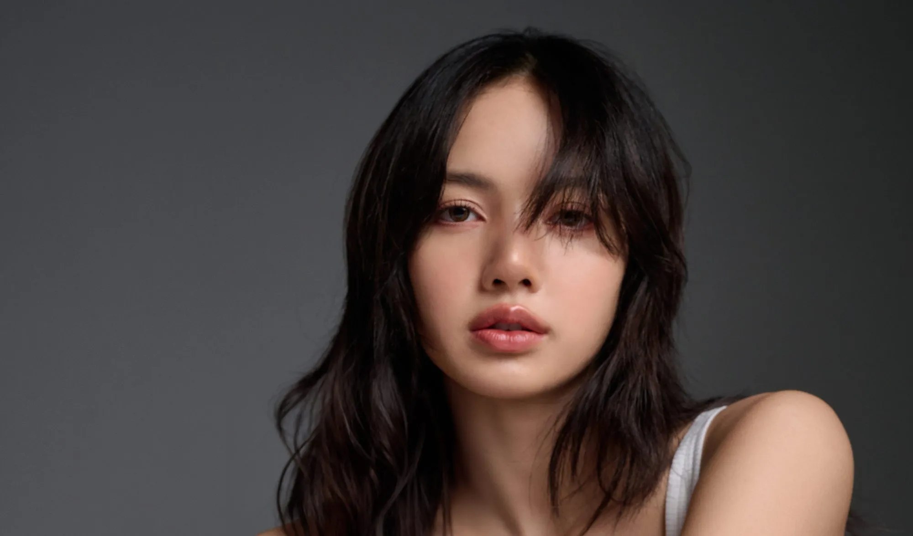

### Step 3: Example image

To extract descriptions from the image and further generate similar model portraits:

```python
import os

filename = "IMAGE_LINK_OR_PATH"
descriptions = describe_service.get_descriptions(file=filename, crop=True)
print(descriptions)
```

Note:
- If passing the file as a link, use the full URL starting with "http(s)://".
- If passing the file as a path, use the `os` library for the full path as shown below:

```python
os.path.join(os.getcwd(), "FURTHER_PATH_TO_THE_IMAGE")
```

Based on our example, we generated the following descriptions:

> Portrait of an Asian woman with shoulder-length hair, wearing a white tank top and posing for the camera in front of a grey background. She has beautiful eyes and lips. The soft yet bold lighting highlights her features and creates a cinematic atmosphere. Shot in the style of Canon EOS R5 at F2.8, ISO400, Shutter speed, the photograph is hyper realistic. --ar 128:75

> Beautiful Asian woman with  shoulder-length hair posing for the camera against a grey background, wearing a white tank top. The portrait photography features studio  lighting, high resolution, and high details with soft light, soft shadows, and natural features. The image was rendered in 3D using Octane  in the style of Hasselblad X2D50c photography at 8K resolution. --ar 128:75

> A photo of an Asian woman with long hair, delicate facial  features and beautiful makeup, wearing light gray , posing for the camera in front view, with a solid grey background. The overall atmosphere is soft and mysterious, with high definition photography style, highlighting her facial details. She has clear skin texture, with bright eyes that reflect confidence. in the style of high definition photography, highlighting her face details. --ar 128:75

> A photo of an Asian woman with long hair, posing for the camera in front of a grey background. She has light makeup and is wearing a white tank top. The lighting highlights her features and skin tone. Her expression looks calm yet contemplative as she gazes directly at the camera. This portrait captures my personal style and atmosphere in the style of Sony A7R IV. --ar 128:75

### Step 5: Generate Images from Descriptions

`get_descriptions` method returns the list of formatted descriptions that Midjourney returned

Let's take the first description as an example:

```python
chosen_description = descriptions[0]
imagine_service.get_images_wo_upscale(prompt=chosen_description, foldername=chosen_description, realism=True, close_up=True)
imagine_service.get_images(prompt=description, idx=-1, crop=True)
```

The `get_images_wo_upscale` method saves MidJourney credits by extracting a grid of results and cropping it into 4 images. To get the upscaled versions, use the `get_images` method with `idx` set to `-1` or specify the specific image on the grid you want to save.

#### Generated images

Here are the images generated based on the chosen description:

<p align="center">
    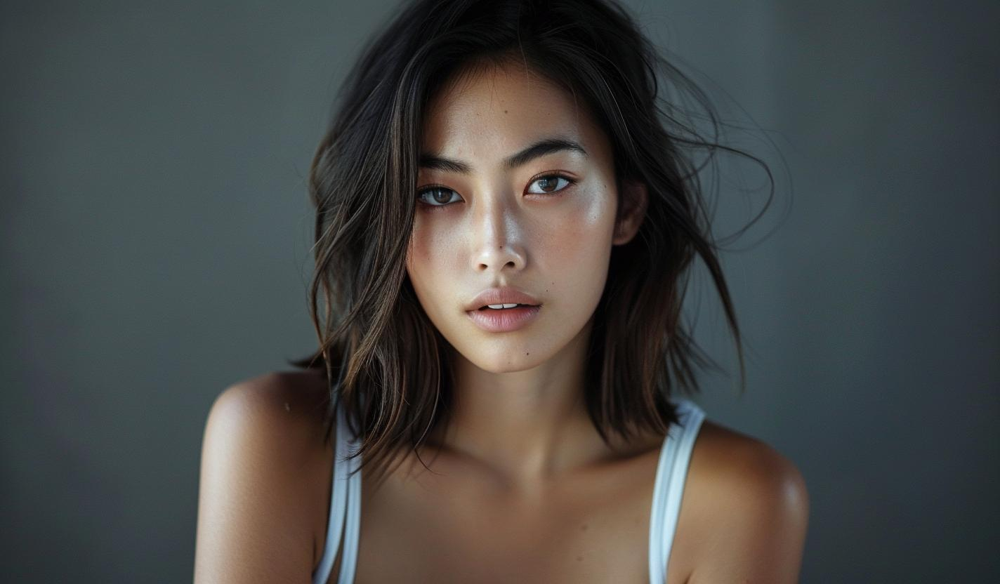
    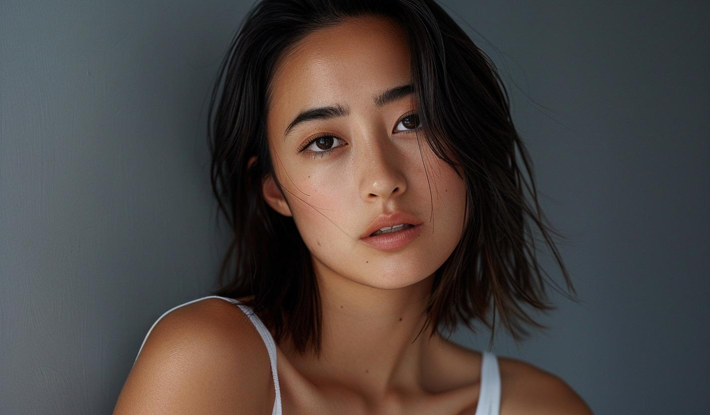
    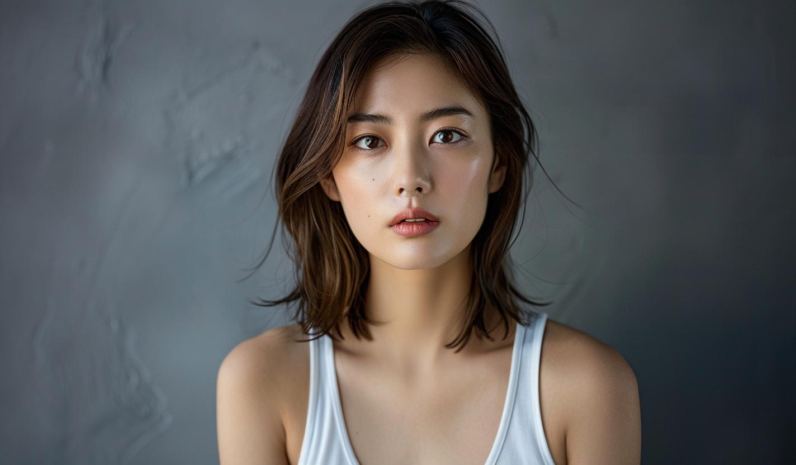
    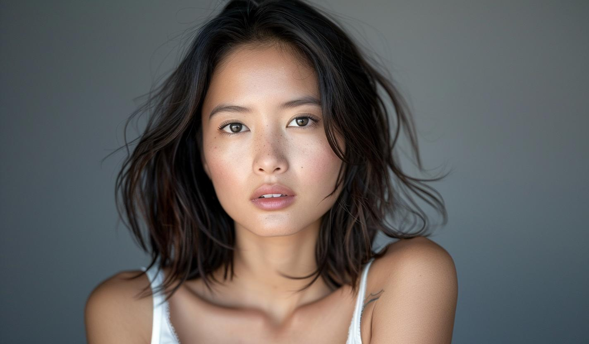
</p>

To see the faces closely, we can crop them using the `crop_face` function from `helpers.py` file:

<p align="center">
    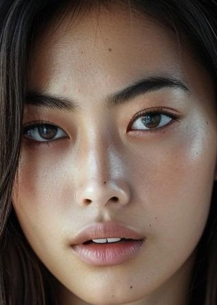
    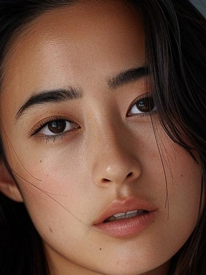
    
    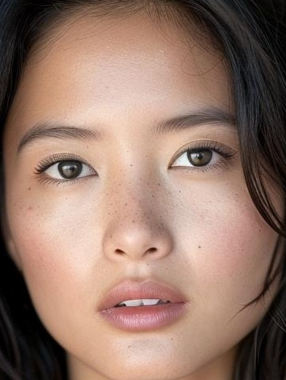
</p>

### Step 6: Swap Faces and Crop them

We will now iterate over all folders in the `overall` directory and swap all faces in each folder with the first face in that folder, and crop the faces.

```python
from glob import glob
from roop import core

from helpers import logme

for folder in glob(os.path.join(os.getcwd(), "overall", "*")):
    cropped_images = glob(os.path.join(folder, "*.jpg"))
    cropped_images.sort()
    for cropped_image in cropped_images[1:]:
        logme(f"Source: {cropped_images[0]}. Target: {cropped_image}")
        source_path = cropped_images[0]
        target_path = cropped_image
        # Get the base filename
        base_filename = os.path.basename(target_path)
        output_path = os.path.join(folder, f"{os.path.splitext(base_filename)[0]}_swapped.jpg")
        core.run(source_path, target_path, output_path)
        crop_face(output_path)
```

### Final results 
All results are saved in the respective folders under the `overall` directory. Additional parameters can be passed into the imagine methods for realism, close-up shots, and cropped faces in the output.

<p align="center">
    
    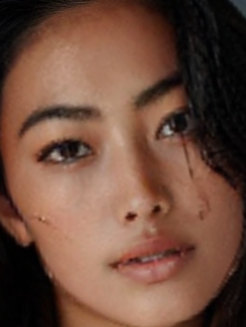
    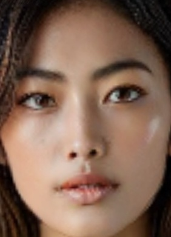
    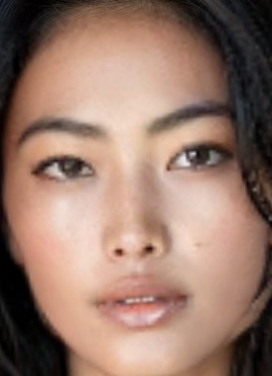
</p>

## Credits

Face swapper used in the current tool is taken from the following repostory. However, during tests, it was found that the results of face detection of insigtface library model named `buffalo_l` are extremely low with accuracy of 61%. Hence, we changed the code of `FaceAnalysis`from **insightface** and changed with the **YOLOv 8 face** model for face detection and its 2D landmarks extraction.

- https://github.com/s0md3v/roop
- https://github.com/hpc203/yolov8-face-landmarks-opencv-dnn